
苦労とかダメ・絶対

## WordPress テーマを GitHub で管理しちゃおう

作成した WordPress テーマを本番環境にお引越しする際に最も簡単なのは All-in-One WP Migration を使ってしまうことですが、問題はその後細かな修正が発生したとき。いちいち FTP ソフトでファイルをアップロードするか、直接ファイルマネージャーをピコピコするか、非効率極まりない。そもそも人的ミスの可能性が高まるので望ましくありません。

ということでお決まりの自動化です。GitHub で管理しながら push して更新、これ最高。

ざっくりとした手順はこちら。
（今回 GitHub の操作方法は省略します。他にたくさんチュートリアルがあるのでそちらをご参考にしてくださいませ 😅）

1. GitHub にリポジトリを作成
1. データベースのお引越し(Migrate DB を使用)
1. Deployhq と GitHub のリポジトリを連携
1. Push!Push!Push!

ちなみに今回の方法は私が勝手に師と仰いでいる Brad Schiff さんの Udemy のコース[Become a WordPress Developer: Unlocking Power With Code
](https://www.udemy.com/course/become-a-wordpress-developer-php-javascript/)に基づいています。全編英語で 27 時間くらいある長編コースですが、WordPress のテーマ開発をするのであれば必見の内容ですよ。

### GitHub にリポジトリを作成

言うまでもないですが、まずは GitHub にリポジトリ（フォルダ）を作成しましょう。どの階層までアップするかは好みにもよりますが、今回は public フォルダをまるっと同期。

**データベースのパスワードを含むためプライベートにするのをお忘れなく。**

### データベースのお引越し

まずはデータベースをお引越ししましょう。phpMyAdmin から手動でダウンロードする手もありますが、一部書き換えが必要なファイルがあり、意外と面倒なのでプラグインで対処します。

今回使ったプラグインは [WP Migrate DB](https://ja.wordpress.org/plugins/wp-migrate-db/)です。ダウンロードして有効化すると以下のような画面になります。

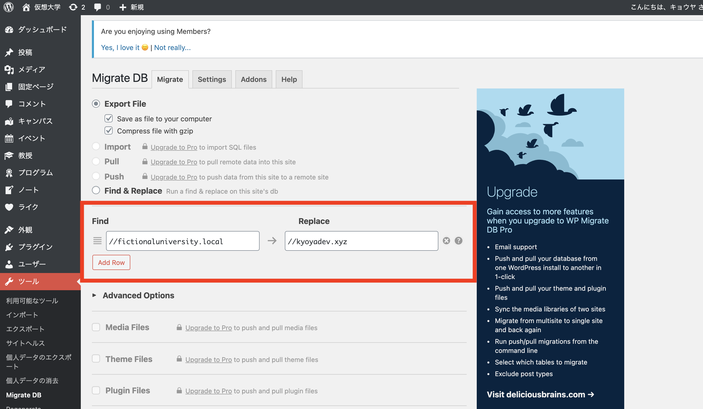
中段の find/replace の箇所にアップロードする環境の URL を入力します。http,https は除いておきましょう。実行すると書き換えを勝手にやってくれます。

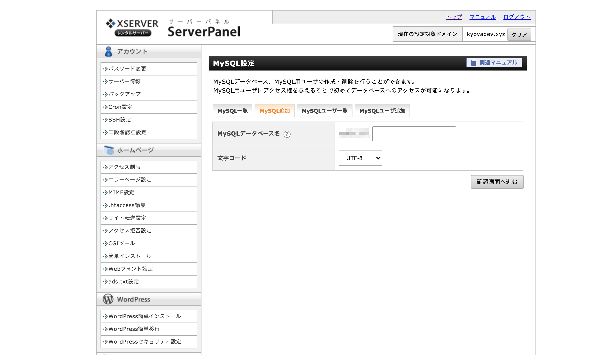
データベースは新規作成してしまうのが手っ取り早くて楽ですね。エックスサーバーの場合は MySQL 設定から作成可能です。**パスワードは後ほど必要になるため忘れないようにしましょう。**

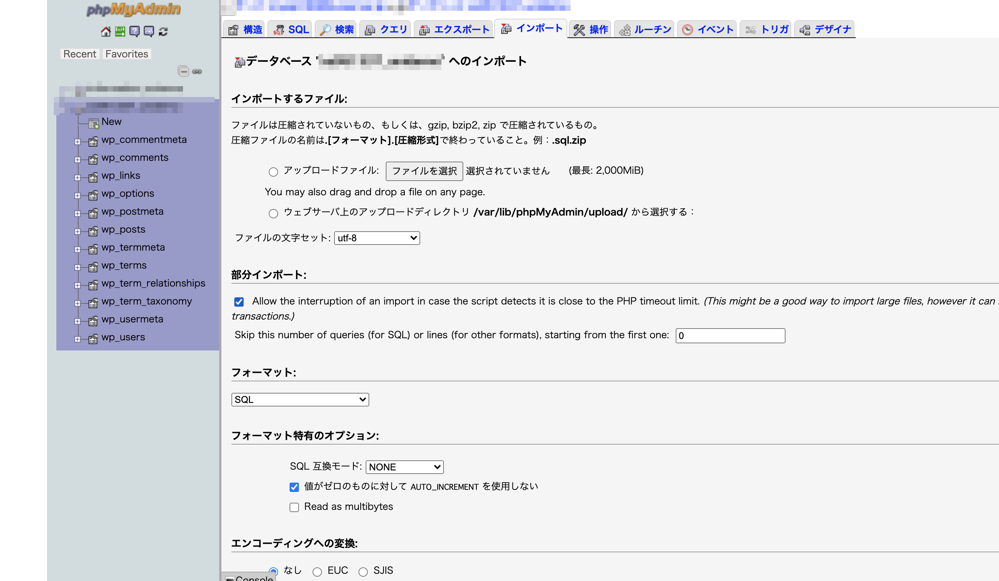
phpMyAdmin を起動して、WP Migrate DB でダウンロードした sql データをインポート。画像は既にインポートし終えているので WordPress のファイルが色々入ってます。

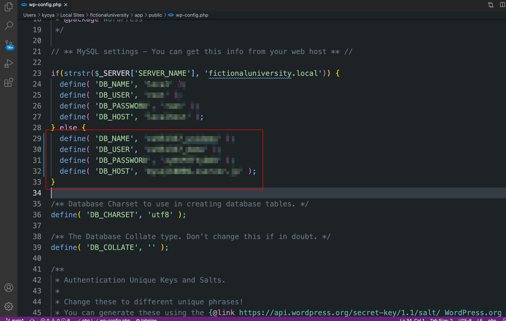
データーベース引っ越し完了！といきたいところですが、作成した WordPress ファイルとデータベースを紐付けなければなりません。wp-config.php の MySQL 設定を編集します。

上の画像では開発環境と本番（テスト）環境で対象のデータベースが異なるため、if 文で分岐しています。第二引数は各自のドメインを入力してください。

ちなみに photoshop を練習したくて余計なところまでモザイクかかってます 😂

### Deployhq と GitHub のリポジトリを連携

git と連携することによって自動でデプロイしてくれるサービスはいくつかありますが、今回は 1 プロジェクトまで無料で使える Deployhq にお世話になりました。

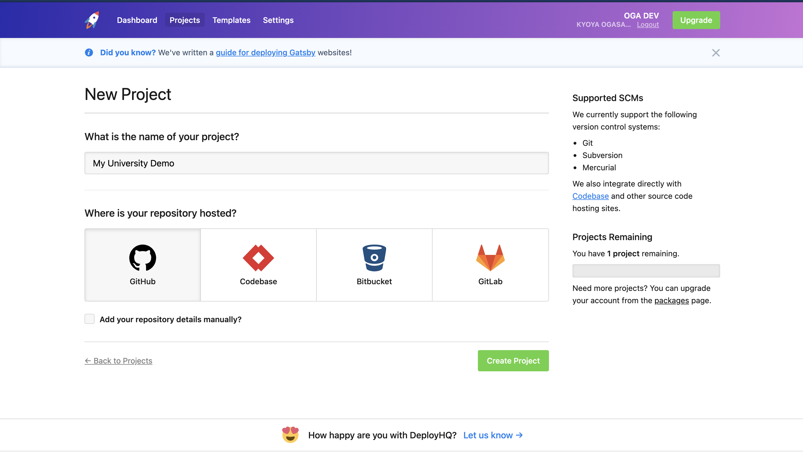
（なければ）アカウントを作成後、プロジェクトを適当に作成して GitHub と連携させます。

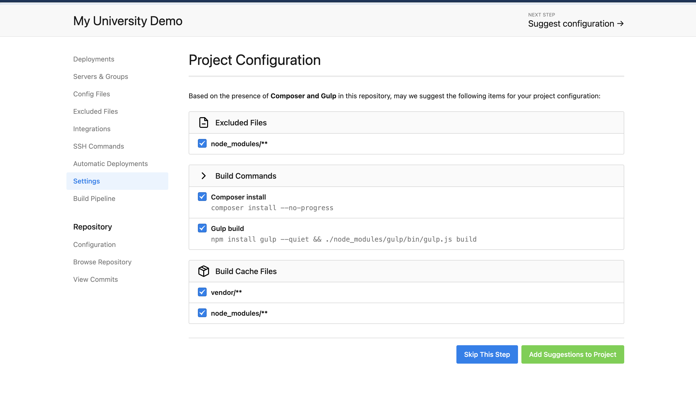
詳細設定はシカトで大丈夫です。Skip This Step!

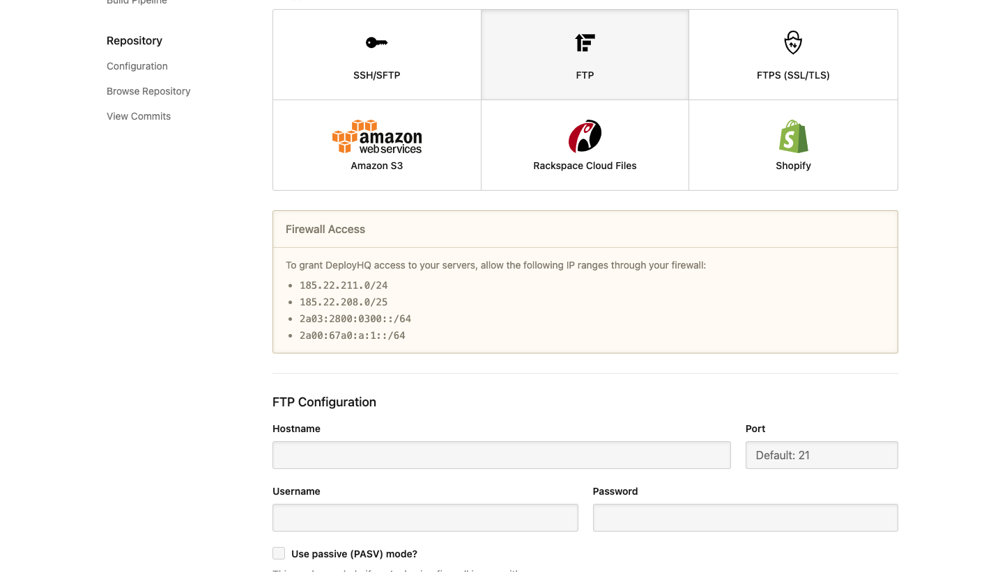
次に WordPress ファイルを送り込むサーバーを設定します。今回はイージーな FTP を使用しましたが、セキュリティ的には SSH 等を選択した方が良いかもしれません…。

画像では見切れているのですが（！）、**パスの設定もお忘れなく**。これを忘れると訳のわからない場所にファイルがアップされます 👼

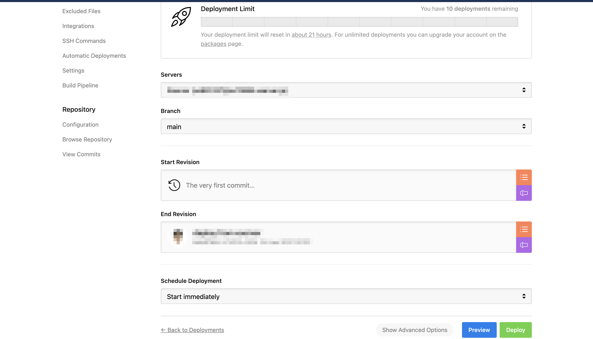
設定が完了したらいざデプロイ！

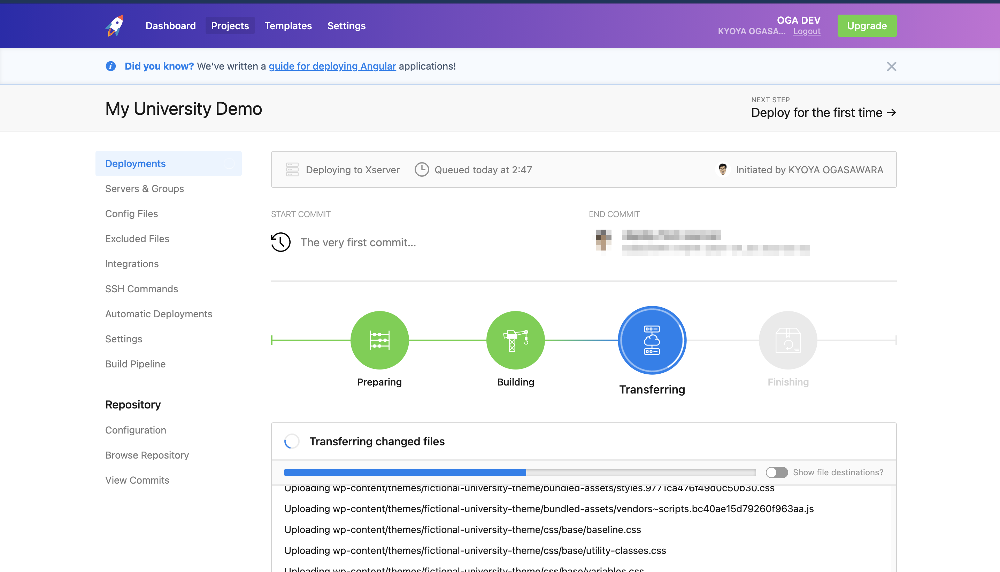
ドゥルドゥルとデータが送り込まれていきます。

### 完了！やったね！

デプロイが完了したら WordPress サイトが本番（テスト）環境で普通に見られるようになっているはずです。あとは GitHub に Webhook を設定して push の度にデプロイされるようにしましょう（日本語！）。

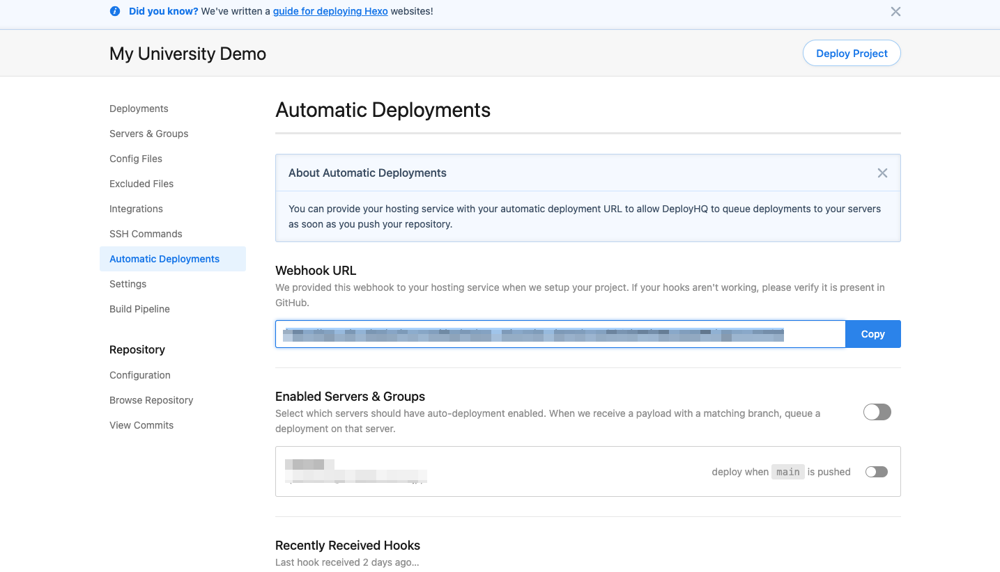
Deployhq の Automatic Deployment 設定にて Webhook URL をコピー。

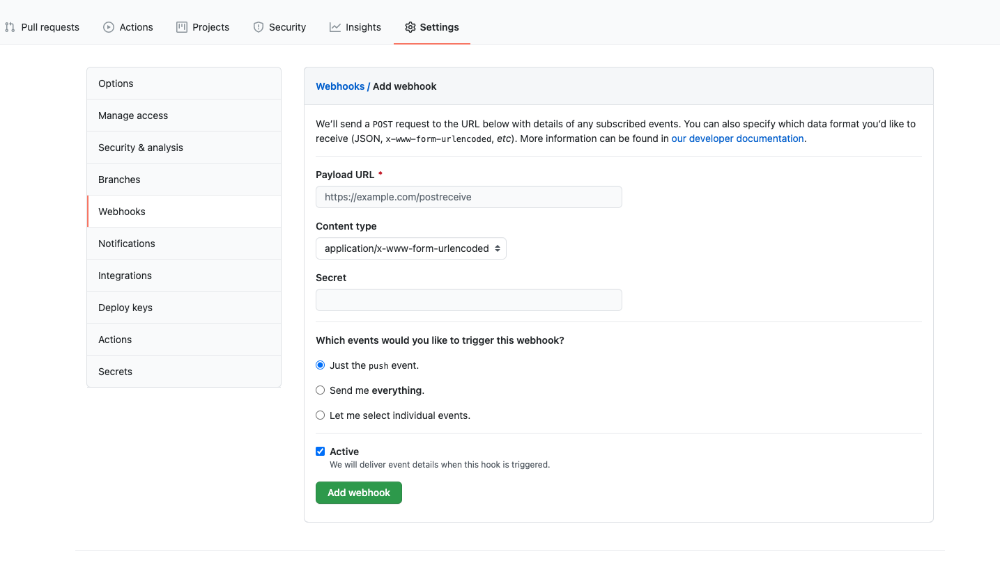
GitHub リポジトリの設定画面の Webhooks にて Payload URL にさっきコピーした Webhook URL をペースト。その他の設定はとりあえずデフォルトのままで構いません。

## おめでとうございます！

  <iframe
    src="https://giphy.com/embed/g9582DNuQppxC"
    width="100%"
    height="100%"
    style="position:absolute"
    frameBorder="0"
    class="giphy-embed"
    allowFullScreen
  ></iframe>

  <a href="https://giphy.com/gifs/hero0fwar-karmawhore-rhyming-g9582DNuQppxC">
    via GIPHY
  </a>

gatsbyjs のチュートリアルで見ない日はないディカプリオ様（ちなみに映画グレート・ギャツビーのワンシーン）。

## 結論

今回の自動デプロイ設定は実務でも間違いなく使える方法ですが、コスト面だけやや気になります（Deployhq の場合、有料プランでも充分安いと思いますが）。

聞いたところでは、Github Actions というサービスでも同様のことができて、しかも一定量まで無料とのこと。今度探ってみようと思います。

ではまた。
